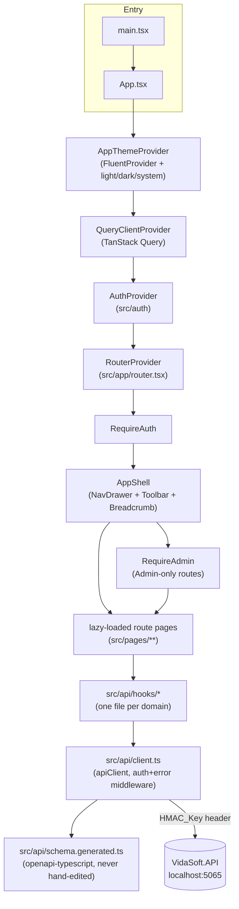
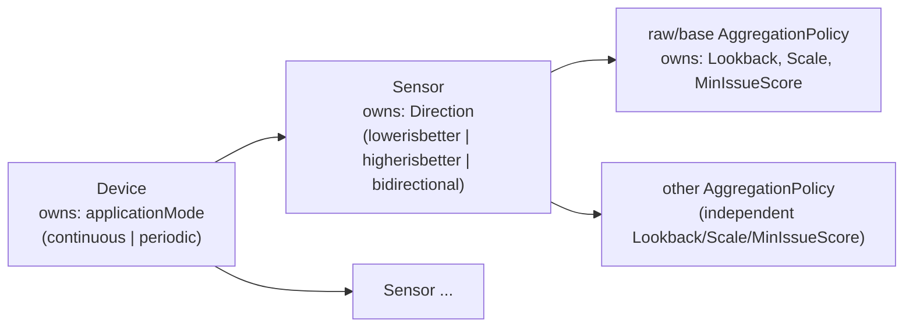
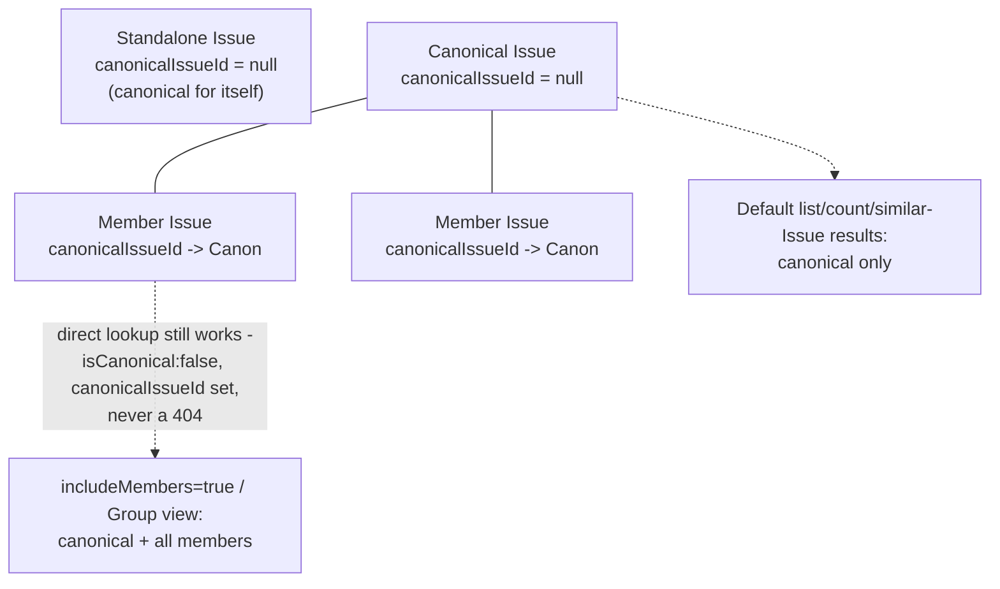

# PRECOG Dashboard — Product, Domain & Architecture

The detailed "why" behind this dashboard's behavior. `AGENTS.md` states the
rules; this file explains the reasoning; `TASK_IMPLEMENTATION.md` tracks
what's actually done. Read all three before making a structural change.

## Product purpose

PRECOG is a predictive-maintenance platform. This dashboard is its human
front end — the operational and analytical surface for the Admins and
Readers of one Company at a time. It supports:

- Operational Device and Sensor monitoring.
- Live or near-real-time Sensor monitoring (bounded polling — see §"Live
  Monitoring").
- Bounded telemetry exploration.
- Smart Analytics — historical, multi-Sensor, multi-Device analysis.
- Same-Device Sensor comparison and two-Device comparison.
- Canonical Issue management: review, categorization, grouping.
- Manual, Admin-approved knowledge sharing between Devices.
- TrainingRequest monitoring and manual retraining requests.
- ModelVersion and compatibility status where the API actually exposes it.
- Model query and its ranked similar historical Issues.
- Ollama job monitoring (submit, poll, cancel).
- Company administration: Reader Device-access grants, DevicePrincipal
  lifecycle, Locations/DeviceGroups/DeviceClasses reference data.

**The old dashboard is a product-reference prototype only.** It's useful for
the workflows, visual ideas, live-monitoring instinct, and comparison
concepts it demonstrated — none of its JavaScript architecture, API calls,
state management, routing (or lack of it), CSS, hidden test functions, or
insecure behavior (a plaintext password held resident in memory to support
a silent auto-refresh loop, a hardcoded client-side backdoor password) is
preserved. See `TASK_IMPLEMENTATION.md`'s replacement matrix for the
specific old→new mapping of every feature.

## Frontend architecture



### Folder structure

```text
src/
  api/
    client.ts            centralized apiClient + auth/error/cancellation middleware
    errors.ts             normalizeApiError - the 3 real error-body shapes
    domainTypes.ts        hand-typed shapes the live OpenAPI doc leaves undocumented
    authHeaderPatch.ts     type-only patch for the generated schema's HMAC_Key quirk
    queryClient.ts        TanStack Query client + retry/backoff policy
    queryKeys.ts           one query-key factory, so invalidation can't drift
    schema.generated.ts    generated - regenerate with `npm run gen:api`, never hand-edit
    hooks/                 one file per API domain (devices, sensors, issues, ...)
  auth/
    authStore.ts           framework-agnostic in-memory session store
    AuthContext.tsx        React context wrapping authStore + GetUserDetails
    RequireAuth.tsx         route guard - no session -> /login
    RequireAdmin.tsx        route guard - not Admin -> in-page NotAuthorizedState
  app/
    router.tsx              route table, every route lazy-loaded
    AppShell.tsx             NavDrawer/Toolbar/Breadcrumb/theme menu
    navConfig.ts             single source of truth for nav items + route table
  theme/
    theme.ts                 PRECOG-blue-derived Fluent brand ramp
    ThemeContext.tsx          light/dark/system, persisted locally
  components/
    PageHeader.tsx, StatusPill.tsx, DateTimeField.tsx
    charts/TelemetryChart.tsx, palette.ts
    states/LoadingState.tsx, EmptyState.tsx, ErrorState.tsx, NotAuthorizedState.tsx
  lib/
    dateTime.ts, pollIntervals.ts, useMediaQuery.ts, useNumberSearchParam.ts, usePageVisible.ts
  pages/
    one folder per domain, one file per route (see TASK_IMPLEMENTATION.md's route matrix)
  test/
    setup.ts
```

### Route architecture

`src/app/router.tsx` uses React Router 7's data-router `lazy` field on every
route below `/login`, so each page ships as its own build chunk (verified —
see `TASK_IMPLEMENTATION.md`'s test/verification matrix). `navConfig.ts` is
the single source shared by the `NavDrawer` and, implicitly, the route
table, so nav visibility and routing can't drift apart.

### Theme system

`src/theme/theme.ts` derives a 16-step Fluent brand ramp from the existing
PRECOG blues (`#014F91`/`#0077CB`) via `createLightTheme`/`createDarkTheme`,
so the rebrand reads as continuation, not reset. `ThemeContext.tsx` tracks a
`light | dark | system` preference in `localStorage` (a harmless local UI
default, never anything auth-related — see AGENTS.md's persistence rules)
and a live `matchMedia('(prefers-color-scheme: dark)')` listener for the
`system` case.

### Responsive application shell

`AppShell.tsx`'s `NavDrawer` is `type="inline"` (persistent) at desktop
widths and `type="overlay"` (triggered by a `Hamburger`) below 1200px, using
`useBreakpoint()` (a real `matchMedia`-backed hook, not a guessed width).
`DeviceListPage.tsx` demonstrates the DataGrid-desktop / card-list-mobile
pattern that other dense-table pages should follow as they're built out.

### Generated OpenAPI types and their ownership

`npm run gen:api` runs `openapi-typescript` against the live
`http://localhost:5065/swagger/v1/swagger.json` and writes
`src/api/schema.generated.ts`. That file is never hand-edited — full stop.
Two gaps in what it can express are handled outside it, never by editing it:

1. **The `HMAC_Key` header is typed as a required call-site parameter** on
   every operation (Swashbuckle emitted it as an explicit header parameter
   for the custom `[ValidateHMAC]` attribute, not just via
   `securitySchemes`), even though `client.ts`'s middleware injects it
   centrally. `authHeaderPatch.ts` is a shallow, non-invasive mapped type
   (`AuthPatchedPaths`) that strips just that one requirement from the type
   `createClient<T>()` is instantiated with — it never touches the
   generated file itself, and it doesn't touch request/response body types.
2. **Some response shapes are undocumented in the live OpenAPI document
   itself** (prose-only descriptions, no schema) — the two Authentication
   endpoints, `User_GetUserDetails`, and the four telemetry-ingestion `202`
   bodies. `domainTypes.ts` hand-types the ones this frontend actually
   consumes, each with a comment citing the gap, confirmed against backend
   source by the modernization audit's deep-dive pass (see that document's
   discrepancies D1/D3/D5–D7).

### Centralized `openapi-fetch` wrapper (`src/api/client.ts`)

One `apiClient` instance, one `authMiddleware`:

- **Base URL** from `VITE_API_BASE_URL` — throws at import time if unset.
- **Auth header** — `onRequest` reads the current token from `authStore` and
  sets `HMAC_Key`. No call site ever sets it itself.
- **Error normalization** (`errors.ts`) — `onResponse` on a non-2xx clones
  the response, classifies the body into one of the three real shapes this
  API actually returns (plain string / ad-hoc `{Message|message}` object /
  genuine `ValidationProblemDetails` from automatic model-binding failure —
  **never** assume the uniform `ProblemDetails` envelope the integration
  guide claims; the running API has no such middleware, confirmed against
  `Program.cs`), and throws a typed `ApiError`.
- **401** — `notifyUnauthorized()` clears the session centrally; every
  `RequireAuth`-guarded route reacts via `useSyncExternalStore`.
- **403/404/409** — left on `ApiError.status` for the call site to render
  the page-appropriate state.
- **429** — `ApiError.retryAfterSeconds` from the `Retry-After` header;
  `queryClient.ts`'s retry policy waits exactly that long, once, before
  giving up.
- **Correlation ID** — opportunistically read from `X-Correlation-Id`/
  `X-Request-Id` response headers (none of the current operations emit one
  over HTTP — the one real correlation surface today is
  `OllamaJobDto.correlationId` in the body itself, per the Deployment
  Runbook's "safe cross-referencing points for support/debugging" guidance;
  the Ollama Jobs page should — and the header hook already can, once one
  exists — surface both).
- **Network failure** — a separate `onError` hook, since `fetch()` itself
  throws before any `Response` exists for offline/DNS/CORS/connection-refused
  failures; normalized into the same `ApiError` shape with `status: 0`.
- **Cancellation** — every hook forwards TanStack Query's `signal` into the
  underlying call.

### TanStack Query conventions

- **Query keys** — one factory, `src/api/queryKeys.ts`. A hook never
  hand-writes an array key inline, so a mutation's `invalidateQueries` can't
  silently drift out of sync with the query it's meant to invalidate.
- **Invalidation** — each mutation hook invalidates exactly the query keys
  its own operation is documented to affect (e.g. `useUpdateDevice`
  invalidates both `queryKeys.device(id)` — via `setQueryData` for an
  instant update — and `queryKeys.devices`, since the list view also shows
  the changed field).
- **Mutations** — `useMutation` throughout; no page manages its own loading/
  error boolean by hand.
- **Cancellation** — see above; this is what makes "no duplicate active
  request for the same query" and "cancel obsolete requests" true for free.
- **Polling lifecycle** — see `src/lib/pollIntervals.ts` (the single place
  every interval is defined) and the Live Monitoring / Training / Ollama
  sections below for exactly which query polls, at what interval, and what
  stops it.

### Authentication/session architecture

See "Authentication and security" below for the full explanation — in
short, `authStore.ts` is a plain closure-based store (token, principal type,
expiry) with no persistence, wrapped by `AuthContext.tsx` for component
consumption via `useSyncExternalStore`.

### Error normalization

Covered above under the client wrapper — this is the one place in the
codebase that has to know the API's real (not documented) error shapes.

### Forms and validation

Fluent `Field`/`Input`/`Select`/`Textarea` throughout, with inline
`validationState`/`validationMessage` for client-side checks (e.g.
`DateTimeField`'s start-before-end validation). Server-side validation
failures surface through the same `ErrorState`/`ApiError.fieldErrors` path
as every other error, not a separate form-error system.

### Shared components

`PageHeader`, `StatusPill` (four variants: `FreshnessPill`,
`ReviewStatePill`, `JobStatusPill`, `EnabledPill` — every one pairs a color
with a distinct icon and a text label, never color alone), `DateTimeField`,
the four request-state components (`LoadingState`/`EmptyState`/
`ErrorState`/`NotAuthorizedState`), `ConfirmDialog` (the one reusable
confirm/consequential-action dialog — normal or destructive intent, busy
and confirm-disabled states — every page that needs a confirmation uses
this instead of `window.confirm`), `MoveToCanonicalDialog` (built on top of
`ConfirmDialog`, adds the bounded searchable candidate picker described
above), and `AppToastProvider`/`useAppToast` (the centralized Fluent Toast
layer — see "Notifications" below).

### Notifications

A single Fluent Toast layer (`src/components/ToastProvider.tsx`) is the
only in-app notification mechanism — no native `alert`, no
`react-toastify`/`react-desktop-notification` (both removed from the old
dashboard, not reintroduced). `useAppToast()` is called from a mutation's
`onSuccess` at the page level for event feedback that matters beyond the
current view: a save succeeded, a review verdict was recorded, a category
was assigned/accepted/rejected, retraining was requested, a grouping
mutation completed, a DevicePrincipal credential was provisioned/rotated/
revoked/enabled/disabled, a knowledge share was approved/revoked, an Ollama
job was submitted/succeeded/failed/cancelled. A toast never duplicates a
field-level validation error, which stays next to the control that
produced it via the existing `ErrorState`/`Field` `validationMessage` path
— the two are deliberately not the same mechanism. A toast body is always a
short, human-written string, never a raw response body, a token, a Device
Secret, or unfiltered Ollama output. Because `queryClient.ts`'s
`QueryClient` is a module-level singleton created outside React, it can't
call `useAppToast()` directly — `src/components/toastBridge.ts` is a
second bridge module (same closure-registration pattern as
`authStore.ts`), letting the query client's global `onError` handlers
(network failure, 429 with the server's `Retry-After` value) surface a
toast without every call site needing to know about toasts. 401 is
deliberately not toasted globally — the redirect to `/login` is feedback
enough — and 400/403/404/409 stay inline at the call site
(`ErrorState`/field validation) rather than being duplicated as a toast.
Browser desktop notifications remain a future enhancement, not built this
pass.

### Visualization components

`src/components/charts/TelemetryChart.tsx` is the single chart component
behind Live Monitoring, Smart Analytics, Device/Sensor comparison, and the
Issue-detail telemetry view — replacing the old dashboard's three
independently copy-pasted (and buggy — a literal duplicate object key)
chart components. It normalizes all four telemetry families
(`src/api/hooks/telemetry.ts`'s `TelemetryPoint`) into one shape, supports
`mode="single"` (control-limit/target bands, anomaly-tinted points) and
`mode="compare"` (clean multi-series overlay, one color + one line-dash
pattern per series so color is never the only distinguishing signal), and
always renders a generated text summary alongside the visual.

### Test architecture

Vitest + React Testing Library, `jsdom` environment (pinned to `25.0.0` —
newer versions currently ship a broken transitive ESM/CJS interop chain via
`html-encoding-sniffer` → `@exodus/bytes`, an upstream bug unrelated to this
project), `vmThreads` pool (Fluent UI's CJS `tabster` dependency fails to
resolve at all under plain `threads` once a test renders a real Fluent
component, e.g. any `Dialog`; several of `vite.config.ts`'s
`deps.optimizer`/`server.deps.inline` options that fix this only take
effect under `vmThreads` — confirmed the whole suite still passes under it,
so it doesn't reintroduce the original `forks`→`threads` jsdom issue), and
one stable `fetch` mock installed in `src/test/setup.ts`
(`src/test/mockFetch.ts` reconfigures it per test — `openapi-fetch`
captures `globalThis.fetch` once at first import of `client.ts`, so a
per-test `vi.stubGlobal` is too late to matter). `@axe-core/playwright` +
`@playwright/test` are also devDependencies, used for the one-off
mocked-browser responsive/accessibility verification pass described above
and in `TASK_IMPLEMENTATION.md` — not part of the `npm test` unit-test run.
See `TASK_IMPLEMENTATION.md`'s test matrix for current coverage and gaps.

### Environment configuration

`VITE_API_BASE_URL` is the only environment variable this app reads.
`.env.example` documents it with a placeholder; `.env.local` (gitignored)
holds the real value for local development against the Dockerized API.

### Performance constraints

- Every list read is bounded (`take`/`skip`, capped Sensor-overlay count).
- No ML/anomaly/similarity/`GetElbow` computation happens in the browser —
  see AGENTS.md's rule; every such value is rendered directly from an API
  response.
- Polling is centrally defined (`pollIntervals.ts`) and stops on a terminal
  status where one exists. Every interval query pauses in a backgrounded
  tab — TanStack Query's `refetchIntervalInBackground` defaults to `false`
  for all of them, gating actual execution on window focus. Live Monitoring
  additionally uses `usePageVisible()` explicitly, not to duplicate that
  pause (redundant with the library default) but to drive its own visible
  "Paused - tab not visible" UI text and its manual live/paused toggle.
- Route-level code splitting keeps the initial bundle from growing with
  every new page.

## Backend concepts reflected by the dashboard

### Tenant and roles

Company is the tenant boundary — every resource this dashboard shows is
scoped to the caller's one authorized Company; there is no cross-Company
browsing anywhere in the API, so none exists in the UI either. Admin is
Company-scoped (sees every Device in the Company). Reader is read-only and
sees **only** Devices explicitly granted through the direct
`UserDeviceGrant` model (plus group/location-derived access, surfaced via
`EffectiveAccess`) — Reader access is never inferred from Company membership
alone, and the frontend never renders a mutation control for a Reader, not
even a disabled one (`RequireAdmin`, and the `isAdmin` check repeated at
every individual mutation control). DevicePrincipal is a machine identity,
architecturally unrelated to human roles — see "Authentication and
security."

### Device and Sensor configuration



This is the single biggest structural break from the old dashboard, which
put Direction/Lookback/Scale/MinIssueScore directly on the Device. Each is
now owned at a different level, and **editing one aggregation level's
Lookback/Scale/MinIssueScore never touches another level's** —
`SensorPoliciesPage.tsx` edits exactly one `SensorAggregationPolicyDto` at a
time, keyed by its own `id`.

`MinIssueScore` affects Issue *qualification* only (the inclusive threshold
a possible Issue's score must clear before it's a real Issue) — it is
explicitly **not** training-defining data, and changing it alone never
retrains or invalidates a model. `Lookback`/`Scale` may affect feature
construction and model compatibility, so `SensorPoliciesPage.tsx`'s
retraining-impact warning fires only when the **raw** policy's Lookback,
Scale, or Enabled state changes — never for a MinIssueScore-only edit, and
never for a non-raw aggregation level.

### Telemetry

Four families — Signal (continuous, unidirectional), Curve (periodic,
unidirectional), BiSignal (continuous, bidirectional), BiCurve (periodic,
bidirectional) — see `src/api/hooks/telemetry.ts`'s `TelemetryFamily` union
and `familyFor()`, which derives the family from `Device.applicationMode` +
`Sensor.direction` (never guessed from a Device-level field, since
`Direction` no longer exists there).

`SensorId` is present in every ingestion request-body item — this frontend
doesn't build an ingestion UI (see AGENTS.md), but every *read* hook passes
`sensorId` as a query parameter, since a single-Sensor read is correctly not
a batch. Every date-range/period-range read is bounded (`take`, plus the
server's own `MaxQueryRangeDays`/`MaxPageSize` clamps) — nothing in this
frontend requests an unbounded telemetry range.

Authoritative anomaly/target/tolerance/control-limit calculation happens
entirely server-side; the frontend only renders `TelemetryPoint` fields as
returned.

### Canonical Issues



Every qualified Issue is retained forever — a member is never deleted, only
its `canonicalIssueId` reference changes. `IssueListPage.tsx` shows
canonical Issues by default (`includeMembers=false`); the explicit toggle
switches to the audit/history view. `IssueDetailPage.tsx`'s Group card shows
the canonical Issue's preserved members with drill-down.

Grouping is **explicit and Admin-controlled** — never inferred from score,
timestamp, aggregation level, similarity, or `GetElbow` (backend `AGENTS.md`:
"Do not infer canonical selection or importance from... any derived
representative-level rule"). Reader may read the Group view for a Device
it's granted; only Admin can group/ungroup/move/reassign. DevicePrincipal
cannot touch Issue management at all.

All five grouping operations have UI: **Group** is Admin-only multi-select
on `IssueListPage.tsx` (checkbox several Issues → a `ConfirmDialog`-based
dialog to pick which one becomes canonical); **Ungroup**, **Move-Group**
("move to another group"), and **Reassign-Canonical** ("make canonical")
live on `IssueDetailPage.tsx`'s Group card, per member, via
`GroupMemberRow`. Move-Group's target is chosen through
`MoveToCanonicalDialog.tsx` — a bounded, searchable Fluent `Combobox`
backed by `Issue_GetIssues` with the current Device and the default
`includeMembers=false`, which returns exactly the canonical-only candidate
set a valid target must be drawn from (the member itself and its current
canonical are excluded client-side). No native `window.prompt` remains
anywhere in this codebase.

### Review states

`PendingReview | ReviewedFault | ReviewedFalsePositive` is the sole
authoritative source of training eligibility (`IssueDto.reviewState`) — the
legacy `confirmed`/`isAnomaly` booleans still exist on the DTO but are an
explicitly lossy derived projection (`ReviewedFalsePositive` and
`PendingReview` both collapse to `confirmed: false`), so this frontend never
reads `confirmed` for anything; every review-state display and every
review-state mutation goes through `reviewState` directly
(`IssueDetailPage.tsx`'s review buttons call `POST /Review` with an explicit
`reviewState`, never the legacy `PUT` path).

Only a human Company Admin may set the review state; Reader is read-only.
Both `ReviewedFault` and `ReviewedFalsePositive` are valid, distinctly
labeled training examples; `PendingReview` is always excluded from training.
A review-state change is an eligibility-changing event — it advances the
Device's (and any actively-sharing target Device's) training generation and
schedules a coalesced retraining request, asynchronously, never
synchronously inside the review HTTP call.

### Categories

Category and review verdict are **separate concepts** — assigning a category
never changes `reviewState`, and vice versa. Categories are a Company-scoped,
extensible catalog (`CategoriesPage.tsx`), never a fixed enum; retiring a
category preserves history rather than deleting it (`useSetIssueCategoryEnabled`,
never a delete endpoint — there isn't one). Ollama may propose one advisory
2–3 word suggestion (`IssueCategorySuggestionDto`); only an Admin's
`accept`/`reject` decision (`useDecideCategorySuggestion`) is ever effective
— requesting or viewing a suggestion never itself triggers retraining
(backend `AGENTS.md`: "Creating, viewing, or regenerating an automatic
category suggestion does not trigger retraining"). Only a human Admin's
*confirmed* category assignment or review-verdict override triggers the
coalesced retraining generation advance.

### Training and models

One model lineage per Device — training and inference always use the
Device's **complete** current Sensor/aggregation-policy set, never only the
Sensor whose data triggered the request (`useCreateTrainingRequest`'s
optional `sensorIds` param is documented as non-narrowing for exactly this
reason). `TrainingRequestDto.status` moves
`Pending → Claimed → Processing → Completed/Failed/Cancelled`
(`TrainingPage.tsx` polls only while in one of the first three states, via
`POLL_INTERVALS_MS.activeJob`, and stops entirely at a terminal one).

Requests are identified by (target Device, requested eligibility
generation), never a time window — a Pending request coalesces onto the
newest generation; a Claimed/Processing request is never mutated, so exactly
one follow-up runs after it completes. `triggerReasons` is diagnostic-only
(why a Device retrained), never something this frontend treats as an input
to anything.

Pipeline v1 (label = Device-scoped `Issue.IssueKey`) and v2 (label =
globally-unique `Issue.Id`, required once cross-Device knowledge sharing
became trainable) are both fully servable; a stored `ModelVersion` is never
reinterpreted under the other pipeline's semantics. This frontend doesn't
need to branch on pipeline version anywhere — it only ever reads
`ModelVersionId`/`VersionNumber` as opaque identifiers.

Internal model blobs and storage paths are never exposed by the API and
therefore never appear in this frontend. **No ModelVersion list/detail
endpoint exists at all** (see "Missing backend capabilities" below) — the
Training page shows only what `TrainingRequestDto`/`ModelQueryResponse`
actually return, with an explicit in-page note that "previous versions"
browsing isn't currently possible, rather than a fabricated history list.

### Knowledge sharing

Explicit, same-Company by default, Admin-approved, versioned per
source→target Device pair. `KnowledgeSharingPage.tsx`'s flow mirrors the
backend exactly: `GET Compatibility` (inspect before creating) → `POST /`
(Draft) → `POST {id}/Approve` (requires 100% target-position coverage,
enforced client-side as a running count before the button even enables,
mirroring the server's own hard requirement) → `POST {id}/Issues` (select
which canonical, reviewed source Issues actually transfer — never
`PendingReview`). `DeviceClassDto`/`DeviceClassMapping` are shown as
informational context only (never as compatibility proof — "Sensor names
and IDs alone are insufficient," backend `CLAUDE.md`); every compatibility
claim in the UI traces to a live `StreamCompatibilityDto.compatible`/
`failures[]` field, never an inference from display names. The target
Device always gets its **own** new `TrainingRequest`/`ModelVersion` — a
share never copies model bytes or an active-model reference.

Two-Device comparison in Smart Analytics is a read-only visualization —
it never itself approves a share, remaps a Sensor, classifies an Issue,
groups Issues, or triggers training; it only offers an Admin-only link
*into* the separate Knowledge Sharing workflow with the two Devices
prefilled.

### Ollama

Fully asynchronous, at-least-once delivery — `Ollama_SubmitSummaryJob`
returns `202` immediately with a `Queued` job; `OllamaJobsPage.tsx` and the
Issue-detail summary card poll `GET /Jobs/{id}` on `POLL_INTERVALS_MS.activeJob`
until a **terminal** status. **The real terminal-success value is
`"Succeeded"`** — both `API_Integration_Guide.md` (§10) and the live
OpenAPI operation description say `"Completed"`, and both are wrong,
confirmed against the actual enum and controller source
(`Enums.OllamaJobStatus.Succeeded`, consumed via `.ToString()`). Polling
logic that checked for `"Completed"` would simply never stop — this is the
single highest silent-bug-risk item in the whole integration, called out
explicitly in `src/api/domainTypes.ts`'s `OllamaJobStatus` type and every
hook that consumes it.

Cancel only succeeds while still `Queued` — once a worker claims it,
`Cancel` returns `409` and the UI's only correct response is to keep
polling, not retry the cancel. Ollama output is advisory only: a category
suggestion requires Admin acceptance to become real; Ollama itself can never
review, classify, group, confirm, or train anything. User/DevicePrincipal
actor attribution exists on the job (`actorType`) but this frontend never
submits *as* a DevicePrincipal (backend explicitly excludes DevicePrincipal
from Ollama submission — `ActorType != User` → 401). Output is always
rendered as text (`resultText`), never raw HTML.

## Live Monitoring

The supported mechanism is **bounded polling of `MeasuredTrailingPeriods`**
— there is no push/SSE/WebSocket capability anywhere in the API, confirmed
during the original assessment, and none is invented here.
`LiveMonitoringPage.tsx`:

- Polls each Sensor card independently at `POLL_INTERVALS_MS.liveCompactChart`
  (15s) while `live` is toggled on **and** `usePageVisible()` is true —
  pausing when the tab is hidden, per the approved decision.
- Cancels/dedupes automatically via TanStack Query.
- Shows a manual refresh action, a live/paused toggle, and (per-Sensor) the
  latest value, its freshness pill, and a compact recent-trend chart.
- Distinguishes no-data (`EmptyState`), stale-data (`FreshnessPill`'s
  `stale` bucket, computed from `heartBeat`/`measured` age — never from
  "the frontend is currently connected," which proves nothing about the
  Device itself), and request-failure (`ErrorState` with retry) as three
  visually distinct states.
- Shows an explanatory empty state, not a fake reading, for Periodic
  (curve) Sensors — trailing-periods has no meaning for a curve run.

**Documented future enhancements, not blockers** (see
`TASK_IMPLEMENTATION.md`'s missing-capability log): a batched
multiple-Sensor latest-value endpoint, a push/SSE/WebSocket stream, and
server-side telemetry downsampling. None of the three exists today; none
was invented.

## Smart Analytics

`SmartAnalyticsPage.tsx` — Device selection, one-or-more-Sensor selection
(same-Device overlay, capped at 4), bounded wall-clock time range
(`DateTimeField` pair, start-before-end validated, both fields labeled with
the viewer's local zone), and two-Device comparison as a distinct mode.
Aggregation-policy metadata is shown as **reference information**, not a
query filter — the telemetry read endpoints expose no aggregation-level
selection parameter, so the page says so rather than inventing one. Issues
in the selected range are shown from the currently-loaded bounded Issue
list, explicitly labeled as a local filter over that bounded set, never
implying a full-history server search (see "Missing backend capabilities").
Backend-authoritative logic (anomaly, review state, category, similarity)
is always rendered from the API; the only presentation-only calculations
are the selected chart range, local Issue-list filtering, and formatting.

## Sensor and Device comparison

Same-Device Sensor comparison overlays up to 4 Sensors with distinct
color+line-dash pairs per series (never color alone). Two-Device comparison
proves compatibility live via `KnowledgeSharing/Compatibility` before
overlaying anything — a proven-compatible pair gets one overlaid chart; an
unproven pair gets two independent side-by-side panels instead, with the
exact rejection reason(s) shown, never a silent normalization/conversion.
See "Knowledge sharing" above for the comparison-has-no-side-effects rule
and the Admin-only transition link.

## Authentication and security

- Human sign-in: `POST /api/Authentication/Request_HMAC_Key`. The response
  (`{_HMAC_Key}`) has no schema in the live OpenAPI document (prose only) —
  `domainTypes.ts`'s `HmacKeyResponse` is hand-typed from source.
- **Token storage decision**: memory-only, in `authStore.ts`'s closure.
  Never localStorage/sessionStorage/a cookie. A page refresh always requires
  re-authentication — a deliberate carry-over from the old dashboard's one
  correct security property.
- **Token expiry**: the API doesn't return an expiry in the login response,
  so the frontend assumes the documented 900s default for UI purposes
  (`ASSUMED_TOKEN_LIFETIME_SECONDS` in `AuthContext.tsx`) while the *actual*
  enforcement is entirely server-side, caught by the global 401 handler.
- **No silent reauthentication loop.** The old dashboard held the plaintext
  password resident in React state for the whole session specifically to
  support a 14m30s auto-refresh `setInterval`. This dashboard does not do
  that, anywhere. A 401 from any call, on any page, clears the session
  (`notifyUnauthorized`) and the router sends the user to `/login` with the
  attempted route preserved (`location.state.from`) for return-after-login.
- **Logout**: clears the in-memory session; nothing to invalidate
  server-side beyond the token's own natural expiry (there's no logout/
  revoke-token endpoint).
- **One-time Device Secret**: see "Security rules" in `AGENTS.md` — held
  only in `DevicePrincipalPage.tsx`'s local dialog state, copy button +
  persistent warning, discarded on close.
- **Rotation/revocation**: `useRotateDevicePrincipalCredential`/
  `useRevokeDevicePrincipalCredential` — both take effect immediately
  against the database (the API re-validates on every request, not just
  signature validity), even against an already-issued unexpired token.
- **Safe rendering**: covered above under "no raw HTML."
- **Environment variables**: `VITE_API_BASE_URL` only, documented in
  `.env.example` with no real value; `.env.local` is gitignored.
- **No secret persistence** anywhere this dashboard controls.

## Accessibility and responsiveness

- Keyboard navigation, focus management, and dialog focus restoration come
  from Fluent's primitives (`Dialog`, `Drawer`, `Menu`, `DataGrid`) — built
  in, not re-implemented.
- Status is never color-only: every `StatusPill` variant pairs a color with
  a distinct icon shape and a text label.
- Every click-to-navigate `Card`/`div` (as opposed to a real `<Button>`) is
  keyboard-operable via the shared `activateProps()` helper
  (`src/lib/useActivateProps.ts`) — `role="button"`, `tabIndex={0}`, and
  Enter/Space activation. `DeviceListPage`'s `DataGrid` row gets a keyboard
  handler instead (Fluent's `DataGrid` already provides its own grid-level
  ARIA semantics; adding a conflicting `role` would be wrong there).
- Charts carry a generated text summary (`TelemetryChart`'s summary line)
  alongside the visual, for a screen-reader user or anyone who wants the
  numbers without reading a chart.
- `prefers-reduced-motion` is respected in the chart's animation config.
- Responsive: verified, not just built-and-reasoned-through — every
  authenticated route (17 pages) plus `/login` was opened in a real
  Chromium browser (Playwright, network-mocked backend) at four
  representative widths (1920×1080, 1366×800, 834×1112, 390×844) and
  checked for horizontal overflow. Zero overflow failures across all
  17×4 combinations checked. See `TASK_IMPLEMENTATION.md`'s Phase 22 and
  "Mocked-browser verification methodology" section for exact scope and
  the two real layout bugs this pass found and fixed (an invalid
  breadcrumb `<li>` nesting, a `setState`-during-render warning).
- An automated accessibility audit (`@axe-core/playwright`) was run
  against 18 page-states in that same session (every top-level route, the
  DevicePrincipal Secret-reveal dialog opened, Issue detail). Concrete
  issues found and fixed: every page was missing a semantic `<h1>`
  (Fluent's `Title2`/`Title1` need the `as` prop — visual size and
  semantic heading level are decoupled by design in Fluent v9), 11
  toolbar-level `Select` device/sensor pickers had a visible but
  unassociated label (fixed with explicit `aria-label`s), and one
  `Switch` and the Smart Analytics date-range inputs were unlabeled (the
  `Switch` fix is confirmed, the date-input fix is not independently
  re-verified — see `TASK_IMPLEMENTATION.md`). Two further findings
  (`landmark-one-main`/`page-has-heading-one` intermittently, and
  `aria-hidden-focus` on Tabster's own internal focus-sentinel elements)
  were investigated and determined to be tooling artifacts, not real app
  defects — see `TASK_IMPLEMENTATION.md`'s Phase 23 for the full
  investigation. **This is a scoped automated pass, not a claim of WCAG
  conformance at any level** — manual keyboard/screen-reader testing and
  color-contrast checks on custom-drawn chart elements were not performed.

## Missing backend capabilities

| Gap | Frontend consequence | Status |
|---|---|---|
| No server-side Issue date-range filter (`Issue_GetIssues` has only `deviceId`/`skip`/`take`/`includeMembers`) | Smart Analytics filters locally over the bounded loaded result, explicitly labeled as such | Documented, not blocking |
| No `NoteHeartBeat` equivalent | Removed per explicit instruction, not replaced or inferred; freshness relies solely on `Device.heartBeat`/telemetry `measured` timestamps | Documented, not blocking |
| No ModelVersion list/detail endpoint | Training page shows only what TrainingRequestDto/ModelQueryResponse actually return | Documented, not blocking |
| No Ollama job list endpoint (submit/get/cancel only) | Ollama Jobs page is a by-id lookup, not a history list, stated in-page | Documented, not blocking |
| No efficient Company-wide Issue/training/Ollama aggregate endpoint | Overview KPIs scoped to one selected Device rather than an unbounded fan-out download | Documented, not blocking |
| No batched multiple-Sensor latest-value endpoint | Live Monitoring polls per-Sensor instead of one batched call | Future enhancement, not a blocker |
| No SSE/WebSocket live telemetry stream | Bounded polling used instead; no streaming protocol invented | Future enhancement, not a blocker |
| No server-side telemetry downsampling | Reads stay bounded via `take`/range limits instead | Future enhancement, not a blocker |
| Telemetry-ingestion `202` response body undocumented in swagger | Not consumed anywhere in this frontend (ingestion is out of scope) | Documented, not blocking |
| `Training_CreateTrainingRequest` authorizes by Device access only, not `IsCompanyAdmin` — a Reader could technically submit a manual retraining request against the real API | This frontend enforces Reader-read-only itself: `TrainingPage.tsx` renders the "Request retraining" control only for `isAdmin`, regardless of what the backend would technically accept. A callable endpoint is not the same as an approved Reader workflow. | Documented, not fixed on either side |

Two confirmed documentation discrepancies (not backend *capability* gaps —
the capability exists, the docs describing it are wrong):

- `API_Integration_Guide.md` §10 and the live OpenAPI operation description
  both say an Ollama job's terminal-success status is `"Completed"`. The
  real wire value, confirmed against source, is `"Succeeded"`. This
  frontend polls for the real value.
- `API_Integration_Guide.md` §11 claims uniform `ProblemDetails` error
  responses. No such middleware exists in the running API — most errors are
  plain strings or ad-hoc objects. This frontend's error normalizer handles
  all three real shapes, never assumes the documented one.
